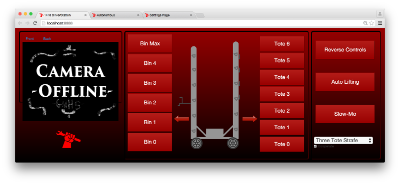

FRC1418 2015 Driver Station Code
================================

* Code: [Robot](https://github.com/frc1418/2015-robot) | **UI** | [Image Processing](https://github.com/frc1418/2015-vision) | [Oculus Rift](https://github.com/frc1418/2015-oculus)
* Factsheet: [Google Doc](https://docs.google.com/document/d/1irbUm-Qfxz_Ua2XiB5KzYWG2Ec5Xhr038NqL-k4FveA)

Introduction
------------

We're really excited to release our Driver Station code for 2015! At the
Greater DC Regional, 1418 won an Innovation In Control award, and the
polished UI was mentioned as one of the reasons for winning the award.

One of the really cool ideas that was a departure from last year's UI 
was using HTML5 & Javascript to create the driver station interface. The
UI features:

* Touchscreen web browser interface provides richer control interface
  for secondary robot operator
* Provides full access to robot functionality
  * Can raise or lower the forklifts to any given position 
  * Enable and disable automatic functions of the robot
  * Tune autonomous modes and other robot parameters in the pits 
* Select one of multiple autonomous modes
* Live streaming camera views to assist operators when view is blocked

The HTML/JavaScript interface is made possible by using [pynetworktables2js]
(https://github.com/robotpy/pynetworktables2js) to forward NetworkTables
traffic to the webpage. pynetworktables2js was initially prototyped by
Leon Tan, our lead UI student, but it is now maintained by the RobotPy
project so that other teams can benefit from our work.

Running the code
================

Requirements
------------

python 3 must be installed!

Make sure you have pynetworktables2 installed:

    pip3 install pynetworktables2js
	
Connect to a local simulation
-----------------------------

Run this command:

    python3 driverStationServer.py
	
Connect to the robot
--------------------

Run this command:

    python3 driverStationServer.py --host=roborio-1418.local

View the output
---------------

Open a web browser (preferably Chrome), and go to:

    http://localhost:8888/
	
You can replace the HTML file at the end of the URL with whatever you're
trying to test.

Authors
=======

Students

* Leon Tan, UI Lead
* Aki Maher
* Jacob Hanse
* Tyler Gogal
* Cami Borja

Dustin Spicuzza, mentor
